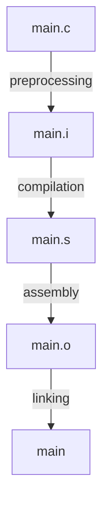

# build step of c file 



## pre-process

#### main.i

```
# 1 "src/template/main.c"
# 1 "<built-in>" 1
# 1 "<built-in>" 3
# 500 "<built-in>" 3
# 1 "<command line>" 1
# 1 "<built-in>" 2
# 1 "src/template/main.c" 2
# 1 "src/template/foo.h" 1


void foo();
# 2 "src/template/main.c" 2


int main() {
    int a = 10;
    int *p = &a;

    foo();

    return 0;
}

```


#### foo.i

```
# 1 "src/template/foo.c"
# 1 "<built-in>" 1
# 1 "<built-in>" 3
# 500 "<built-in>" 3
# 1 "<command line>" 1
# 1 "<built-in>" 2
# 1 "src/template/foo.c" 2
# 1 "src/template/foo.h" 1


void foo();
# 2 "src/template/foo.c" 2

void foo() {
}
```

## Assembly

#### main.s

```
	.section	__TEXT,__text,regular,pure_instructions
	.build_version macos, 26, 0	sdk_version 26, 5
	.globl	_main                           ; -- Begin function main
	.p2align	2
_main:                                  ; @main
	.cfi_startproc
; %bb.0:
	sub	sp, sp, #48
	stp	x29, x30, [sp, #32]             ; 16-byte Folded Spill
	add	x29, sp, #32
	.cfi_def_cfa w29, 16
	.cfi_offset w30, -8
	.cfi_offset w29, -16
	mov	w8, #0                          ; =0x0
	str	w8, [sp, #12]                   ; 4-byte Folded Spill
	stur	wzr, [x29, #-4]
	sub	x8, x29, #8
	mov	w9, #10                         ; =0xa
	stur	w9, [x29, #-8]
	str	x8, [sp, #16]
	bl	_foo
	ldr	w0, [sp, #12]                   ; 4-byte Folded Reload
	ldp	x29, x30, [sp, #32]             ; 16-byte Folded Reload
	add	sp, sp, #48
	ret
	.cfi_endproc
                                        ; -- End function
.subsections_via_symbols
```


#### foo.s

```
	.section	__TEXT,__text,regular,pure_instructions
	.build_version macos, 26, 0	sdk_version 26, 5
	.globl	_foo                            ; -- Begin function foo
	.p2align	2
_foo:                                   ; @foo
	.cfi_startproc
; %bb.0:
	ret
	.cfi_endproc
                                        ; -- End function
.subsections_via_symbols

```

## object file structure

> nm <file.o>

```bash
# main.o
                 U _foo
0000000000000000 T _main
0000000000000000 t ltmp0
0000000000000040 s ltmp1

# foo.o
0000000000000000 T _foo
0000000000000000 t ltmp0
0000000000000008 s ltmp1
```
